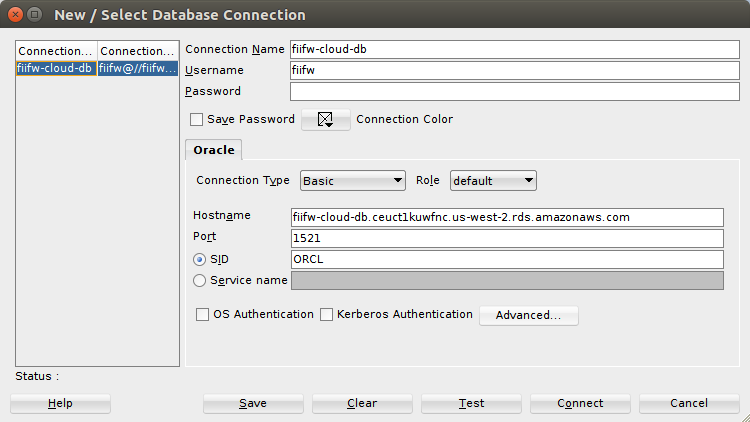

Cum sa te conectezi la baza de date din cloud
=============================================

Ce este, mai exact?
-------------------

Cum structura bazei de date suferea modificari pe masura ce noi
avansam cu dezvoltarea aplicatiei, devenea greoi si, abrupt spus,
o durere de cap inutila sa ne tot sincronizam bazele de date 
intre noi.

Bun, asa ca am mutat baza de date in cloud. Deci modificam intr-un
singur loc, odata si merge la toti. 

Sigur, ca dintr-un anumit unghi, treaba asta poate fi privita ca un
anti-pattern. Complet irelevant pentru noi in momentul de fata.

Cum ma conectez din `SQLDeveloper`?
-----------------------------------

Exact ca in imaginea asta:

| Field           | Value                                                     |
| --------------- |:----------------------------------------------------------|
| Parola          | `f11f3pass`                                               |
| Connection Name | `fiifw-cloud-db`                                          |
| Username        | `fiifw`                                                   |
| Hostname        | `fiifw-cloud-db.ceuct1kuwfnc.us-west-2.rds.amazonaws.com` |
| SID             | `ORCL`                                                    |

Atentie ca jos, la `SID`, `SQLdeveloper` pune `XE`. Trebuie pus `ORCL`.

Da-i `connect` si `save` si gata. Comenzile pe care le executi acum
modifica baza de date din cloud si sunt vizibile tuturor membrilor echipei.
